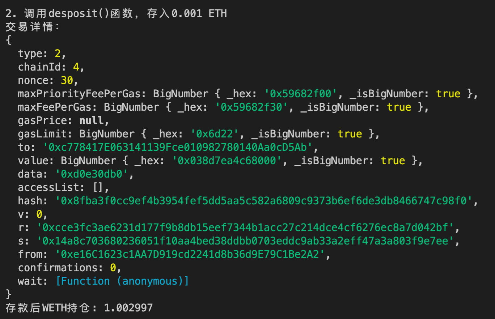
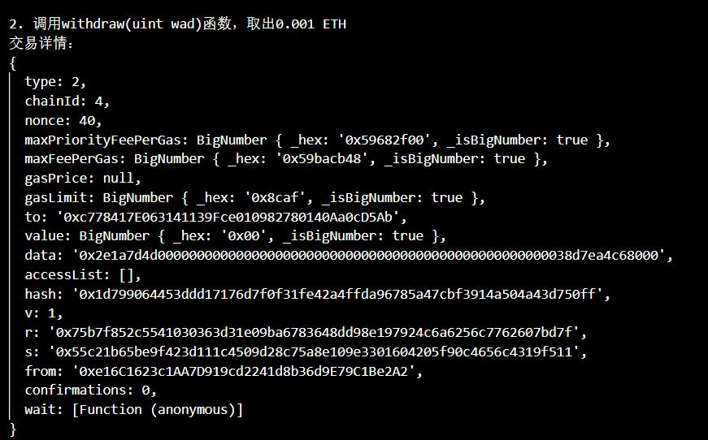

# Ethers极简入门: 5. 合约交互

我最近在重新学`ethers.js`，巩固一下细节，也写一个`WTF Ethers极简入门`，供小白们使用。

**推特**：[@0xAA_Science](https://twitter.com/0xAA_Science)

**WTF Academy社群：** [官网 wtf.academy](https://wtf.academy) | [WTF Solidity教程](https://github.com/AmazingAng/WTFSolidity) | [discord](https://discord.wtf.academy) | [微信群申请](https://docs.google.com/forms/d/e/1FAIpQLSe4KGT8Sh6sJ7hedQRuIYirOoZK_85miz3dw7vA1-YjodgJ-A/viewform?usp=sf_link)

所有代码和教程开源在github: [github.com/WTFAcademy/WTFEthers](https://github.com/WTFAcademy/WTFEthers)

-----

这一讲，我们将介绍如何声明可写的`Contract`合约变量，并利用它与测试网的`WETH`合约交互。

## 创建可写`Contract`变量

声明可写的`Contract`变量的规则：
```js
const contract = new ethers.Contract(address, abi, signer)
```

其中`address`为合约地址，`abi`是合约的`abi`接口，`signer`是`wallet`对象。注意，这里你需要提供`signer`，而在声明可读合约时你只需要提供`provider`。

你也可以利用下面的方法，将可读合约转换为可写合约：

```js
const contract2 = contract.connect(signer)
```

## 合约交互

我们在[第三讲](https://github.com/WTFAcademy/WTFEthers/blob/main/03_ReadContract/readme.md)介绍了读取合约信息。它不需要`gas`。这里我们介绍写入合约信息，你需要构建交易，并且支付`gas`。该交易将由整个网络上的每个节点以及矿工验证，并改变区块链状态。

你可以用下面方法方法进行合约交互：

```js
// 发送交易
const tx = await contract.METHOD_NAME(args [, overrides])
// 等待链上确认交易
await tx.wait() 
```

其中`METHOD_NAME`为调用的函数名，`args`为函数参数，`[, overrides]`是可以选择传入的数据，包括：
- gasPrice：gas价格
- gasLimit：gas上限
- value：调用时传入的ether（单位是wei）
- nonce：nounce

**注意：** 此方法不能获取合约运行的返回值，如有需要，要使用`Solidity`事件记录，然后利用交易收据去查询。

## 例子：与测试网`WETH`合约交互

`WETH` (Wrapped ETH)是`ETH`的带包装版本，将以太坊原生代币用智能合约包装成了符合`ERC20`的代币。对`WETH`合约更详细的内容可以参考WTF Solidity极简合约的[第41讲 WETH](https://github.com/AmazingAng/WTFSolidity/blob/main/41_WETH/readme.md)。

1. 创建`provider`，`wallet`变量。

    ```js
    import { ethers } from "ethers";

    // 利用Infura的rpc节点连接以太坊网络
    const INFURA_ID = '184d4c5ec78243c290d151d3f1a10f1d'
    // 连接Rinkeby测试网
    const provider = new ethers.providers.JsonRpcProvider(`https://rinkeby.infura.io/v3/${INFURA_ID}`)

    // 利用私钥和provider创建wallet对象
    const privateKey = '0x227dbb8586117d55284e26620bc76534dfbd2394be34cf4a09cb775d593b6f2b'
    const wallet = new ethers.Wallet(privateKey, provider)
    ```
2. 创建可写`WETH`合约变量，我们在`ABI`中加入了3个我们要调用的函数：
    - `balanceOf()`：查询地址的`WETH`余额。
    - `deposit()`：将转入合约的`ETH`转为`WETH`。
    - `transfer()`：转账。

    ```js
    // WETH的ABI
    const abiWETH = [
        "function balanceOf(address) public view returns(uint)",
        "function deposit() public payable",
        "function transfer(address, uint) public returns (bool)",
    ];
    // WETH合约地址（Rinkeby测试网）
    const addressWETH = '0xc778417e063141139fce010982780140aa0cd5ab' // WETH Contract

    // 声明可写合约
    const contractWETH = new ethers.Contract(addressWETH, abiWETH, wallet)
    ```

3. 读取账户`WETH`余额，可以看到余额为`1.001997`。

    ```js
    const address = await wallet.getAddress()
    // 读取WETH合约的链上信息（WETH abi）
    console.log("\n1. 读取WETH余额")
    const balanceWETH = await contractWETH.balanceOf(address)
    console.log(`存款前WETH持仓: ${ethers.utils.formatEther(balanceWETH)}\n`)
    ```

    


4. 调用`WETH`合约的`deposit()`函数，将`0.001 ETH`转换为`0.001 WETH`，打印交易详情和余额。`deposit()`函数没有参数，可以看到余额变为`1.002997`。

    ```js
        console.log("\n2. 调用desposit()函数，存入0.001 ETH")
        // 发起交易
        const tx = await contractWETH.deposit({value: ethers.utils.parseEther("0.001")})
        // 等待交易上链
        await tx.wait()
        console.log(`交易详情：`)
        console.log(tx)
        const balanceWETH_deposit = await contractWETH.balanceOf(address)
        console.log(`存款后WETH持仓: ${ethers.utils.formatEther(balanceWETH_deposit)}\n`)
    ```
    

5. 调用`WETH`合约的`transfer()`函数，给V神转账`0.001 WETH`，并打印余额。可以看到余额变为`1.001997`。

    ```js
        console.log("\n3. 调用transfer()函数，给vitalik转账0.001 WETH")
        // 发起交易
        const tx2 = await contractWETH.transfer("vitalik.eth", ethers.utils.parseEther("0.001"))
        // 等待交易上链
        await tx2.wait()
        const balanceWETH_transfer = await contractWETH.balanceOf(address)
        console.log(`转账后WETH持仓: ${ethers.utils.formatEther(balanceWETH_transfer)}\n`)
    ```
    
    
6. 打印ETH和WETH余额，调用`WETH`合约的`withdraw()`函数，取出`0.001WTH`，再打印取款后相应的余额，可以看到WETH从`1.001997`减少到`1.000997`，ETH从`0.004683789696395792`增加到`0.005630884813217944`。增加值少于`0.001ETH`是因为扣除了gas。
     
    ```js
        const address = await wallet.getAddress()
        // 读取WETH合约的链上信息（WETH abi）
        console.log("\n1. 读取WETH余额")
        const balanceWETH = await contractWETH.balanceOf(address)
        console.log(`取款前WETH持仓: ${ethers.utils.formatEther(balanceWETH)}\n`)
        // 读取钱包内ETH余额
        const balanceETH = await wallet.getBalance()
        console.log(`取款前ETH持仓: ${ethers.utils.formatEther(balanceETH)}\n`)
    ```
    
    
    ```js
        // 调用withdraw函数，将0.001 WETH转为ETH
        console.log("\n2. 调用withdraw(uint wad)函数，取出0.001 ETH")
        // 发起交易
        const tx = await contractWETH.withdraw(ethers.utils.parseEther("0.001"))
        // 等待交易上链
        await tx.wait()
        console.log(`交易详情：`)
        console.log(tx)
    ```
    
    
    ```js
        const balanceWETH_withdraw = await contractWETH.balanceOf(address)
        console.log(`取款后WETH持仓: ${ethers.utils.formatEther(balanceWETH_withdraw)}\n`)
        const balanceETH_withdraw = await wallet.getBalance()
        console.log(`取款后ETH持仓: ${ethers.utils.formatEther(balanceETH_withdraw)}\n`)
    ```
    

## 总结

这一讲，我们介绍了如何声明可写的`Contract`合约变量，并利用它与测试网的`WETH`合约交互。我们不仅调用`WETH`的`deposit()`函数，将`0.001 ETH`转换为`WETH`，并转账给了V神。还调用了`WETH`的`withdraw()`函数，将`0.001 WETH`取出并获得了相应的`ETH`。


